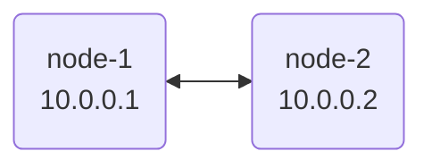

This guide will walk you through setting up a basic Nylon network with two nodes.



## Prerequisites

- Two machines (Linux or macOS) with UDP port `57175` open.
- The `nylon` binary installed on both machines.

## 1. Generate Keypairs

On each node, generate a WireGuard keypair:

```bash
nylon key
```

- **Stdout**: Your private key (keep this safe).
- **Stderr**: Your public key (you'll need this for the central config).

## 2. Create Node Configuration

On each node, create a `node.yaml` file. Replace `<YOUR_PRIVATE_KEY>` with the private key generated in step 1.

```yaml
id: node-1 # Give each node a unique ID (e.g., node-1, node-2)
key: <YOUR_PRIVATE_KEY>
port: 57175
```

## 3. Create Central Configuration

The `central.yaml` file defines the topology of your network. Create one file and share it across all nodes.

```yaml
routers:
  - id: node-1
    pubkey: <NODE_1_PUBLIC_KEY>
    endpoints:
      - "node1.example.com:57175"
    addresses:
      - 10.0.0.1
  - id: node-2
    pubkey: <NODE_2_PUBLIC_KEY>
    endpoints:
      - "node2.example.com:57175"
    addresses:
      - 10.0.0.2

# Define the connections between nodes
graph:
  - "node-1, node-2"
```


## 4. Launch Nylon

Run Nylon on both machines:

```bash
sudo nylon run -c central.yaml -n node.yaml
```

After a few seconds, the nodes will discover each other and establish a secure tunnel. You should be able to ping `10.0.0.2` from `node-1`.

## Next Steps

- Explore [Advanced Configuration](/reference/config) to learn about prefixes and split tunneling.
- Learn how to connect [Passive Clients](/guides/passive-clients) (standard WireGuard apps).
